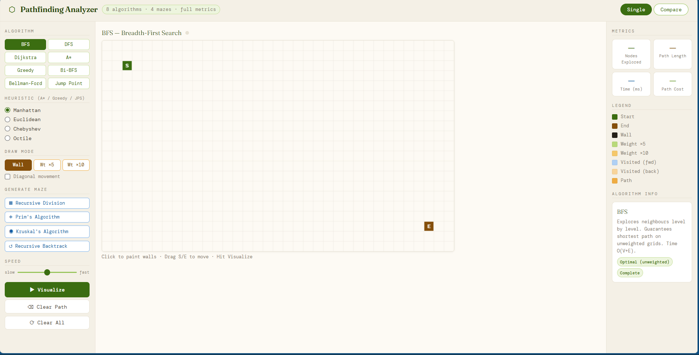
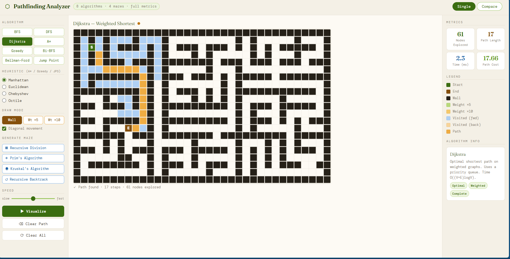
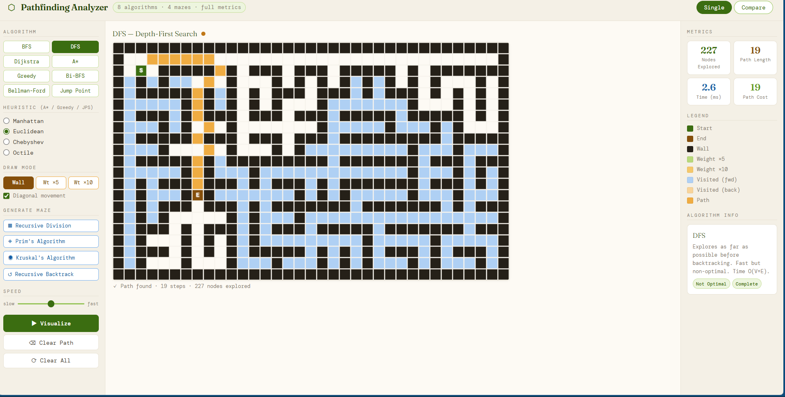
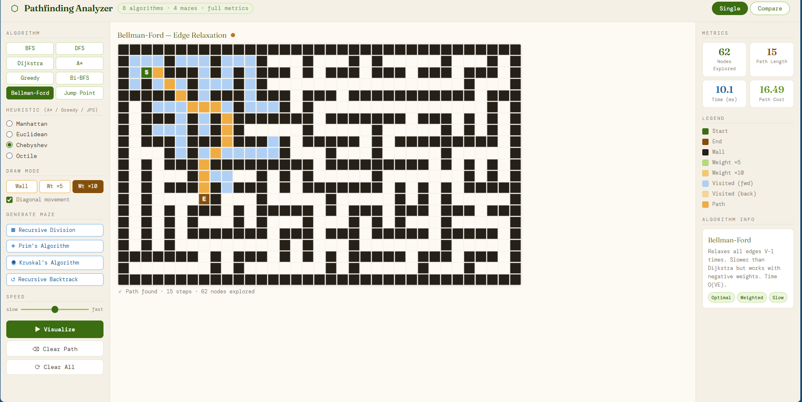
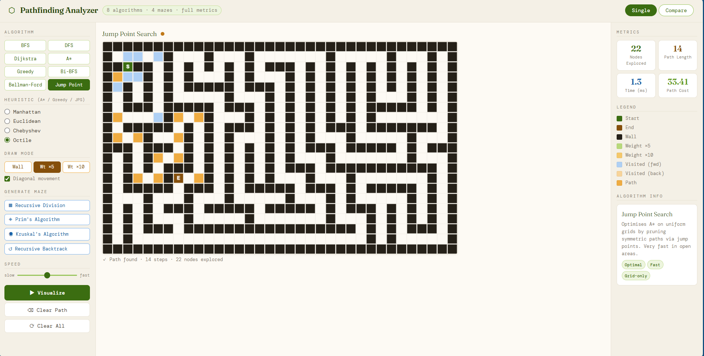
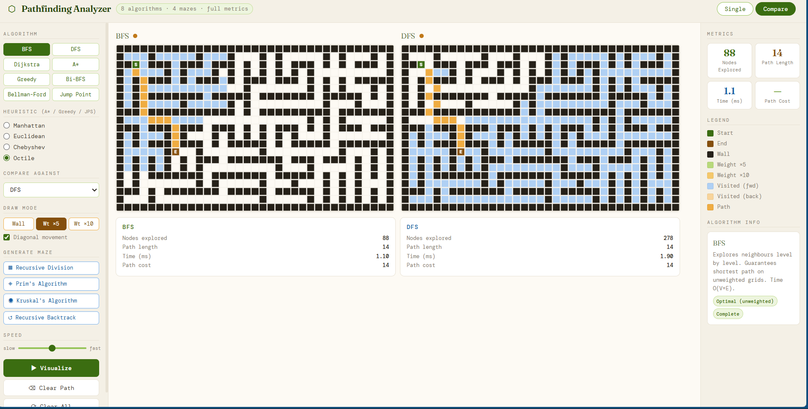
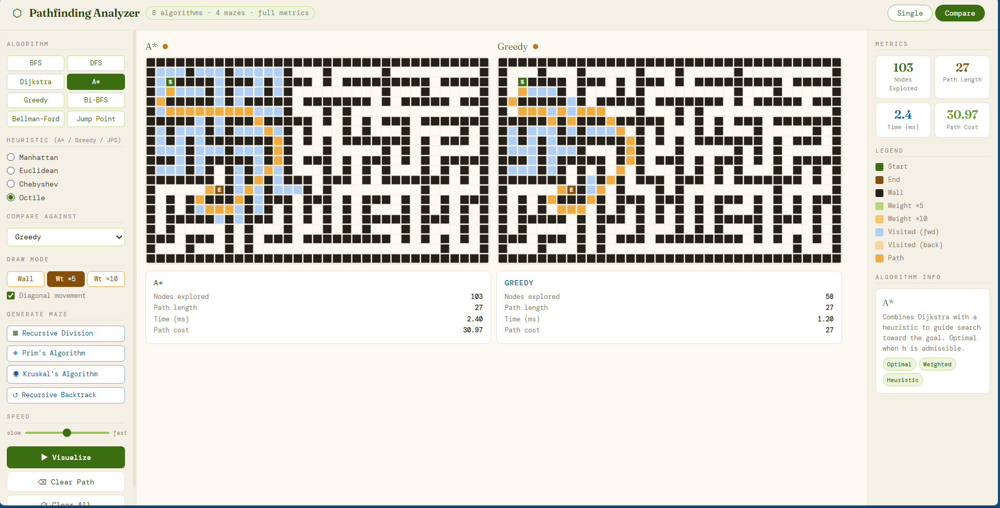

<div align="center">

# Pathfinding Analyzer — Advanced Graph Algorithm Visualizer

Interactive pathfinding and graph-search visualization platform featuring **8 algorithms**, **maze generation systems**, **heuristic tuning**, and **real-time performance comparison tools**.

Built entirely with **Vanilla JavaScript**, focused on algorithm analysis, shortest-path optimization, and interactive systems visualization.


---

## Features

* **Interactive Grid System** — Drag-and-drop source, destination, walls, and weighted nodes
* **Real-Time Pathfinding Visualization** — Step-by-step algorithm animation
* **Weighted Path Analysis** — Compare traversal cost vs shortest distance
* **Advanced Heuristic Support** — Multiple distance heuristics with diagonal movement
* **Maze Generation Engine** — Structured procedural maze creation algorithms
* **Compare Mode** — Side-by-side visualization of algorithm efficiency
* **Performance Metrics Dashboard** — Track runtime, explored nodes, and path statistics
* **Responsive UI System** — Minimal pastel dashboard with live updates
* **Zero Dependencies** — Fully built using native HTML, CSS, and JavaScript

---

## Screenshots

### Home Interface



---

### Algorithm Examples

#### Dijkstra



#### DFS



#### Bellman-Ford



#### Jump Point Search



---

## Algorithm Comparisons

### BFS vs DFS



### A* vs Greedy



---

## Algorithms Implemented

### Uninformed Search

* Breadth-First Search (BFS)
* Depth-First Search (DFS)
* Bidirectional BFS

### Weighted / Optimal Algorithms

* Dijkstra’s Algorithm
* Bellman-Ford Algorithm

### Heuristic Search

* A* Search
* Greedy Best-First Search
* Jump Point Search (JPS)

---

## Heuristic Support

Supports multiple heuristic strategies for informed search algorithms:

* Manhattan Distance
* Euclidean Distance
* Chebyshev Distance
* Octile Distance

Additional features:

* Optional diagonal movement
* Weighted traversal
* Dynamic heuristic switching

---

## Maze Generation Algorithms

Generate procedural test environments using:

* Recursive Division
* Prim’s Maze Algorithm
* Kruskal’s Maze Algorithm
* Recursive Backtracking

---

## Compare Mode

Built-in side-by-side algorithm comparison system.

Compare:

* BFS vs DFS
* A* vs Greedy
* Dijkstra vs Bellman-Ford
* Custom algorithm combinations

Analyze differences through:

* Nodes explored
* Execution speed
* Path optimality
* Traversal efficiency
* Heuristic behavior

---

## Performance Metrics

Tracks:

* Nodes explored
* Path length
* Path cost
* Execution time
* Traversal efficiency
* Heuristic accuracy

---

## Tech Stack

| Layer           | Technology                         |
| --------------- | ---------------------------------- |
| Frontend        | HTML5                              |
| Styling         | CSS3                               |
| Logic Engine    | Vanilla JavaScript (ES6)           |
| Algorithms      | Graph Traversal + Heuristic Search |
| Data Structures | Queues, Priority Queues, Sets      |
| Rendering       | DOM-based Grid Visualization       |
| Architecture    | Modular algorithm engine           |

---

## Project Structure

```bash id="l6j80v"
pathfinding-analyzer/
├── index.html
├── style.css
├── script.js
├── algorithms/
│   ├── bfs.js
│   ├── dfs.js
│   ├── dijkstra.js
│   ├── astar.js
│   ├── bellmanFord.js
│   └── jps.js
├── maze/
│   ├── prim.js
│   ├── kruskal.js
│   └── recursiveDivision.js
├── screenshots/
│   ├── home-page.png
│   ├── example-1.png
│   ├── example-2.png
│   ├── example-3.png
│   ├── example-4.png
│   ├── comparison-1.png
│   └── comparison-2.png
└── README.md
```

---

## Getting Started

### Prerequisites

* Modern web browser
* VS Code Live Server (recommended)

### Installation

```bash id="07av4k"
# 1. Clone the repository
git clone https://github.com/YOUR_USERNAME/pathfinding-analyzer.git

# 2. Enter project directory
cd pathfinding-analyzer
```

### Run Locally

Open:

```bash id="j5fl3v"
index.html
```

Or launch using VS Code Live Server.

---

## How It Works

```text id="fjr21m"
Grid Initialization
        ↓
Algorithm Selection
        ↓
Node Expansion + Frontier Traversal
        ↓
Path Reconstruction
        ↓
Metric Collection + Visualization
```

---

## Concepts Demonstrated

* Graph Traversal
* Heuristic Optimization
* Weighted Shortest Paths
* Pathfinding Systems
* Algorithm Visualization
* Time Complexity Analysis
* Spatial Search Optimization
* Procedural Maze Generation

---

## Technical Highlights

### Weighted Pathfinding

Supports weighted traversal systems where path cost and shortest distance may differ significantly.

### Heuristic Optimization

Implements admissible heuristics for informed search algorithms with optional diagonal traversal support.

### Compare Mode Engine

Runs multiple algorithms simultaneously on identical grid states to visualize efficiency tradeoffs in real time.

### Visualization Pipeline

The rendering engine animates:

* Frontier expansion
* Visited node traversal
* Final shortest path
* Weighted node interaction
* Search progression timing

---

## Future Improvements

* Dynamic graph editor
* Floyd-Warshall visualization
* Negative edge support
* Complexity chart overlays
* Custom heuristic builder
* React + TypeScript migration
* WebAssembly optimization
* GPU-accelerated rendering

---

## Project Status

* Core visualization system complete
* Compare mode implemented
* Maze generation stable
* Expanding toward advanced graph analytics

---

## License

MIT © Manya Singh
